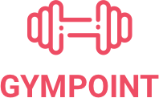
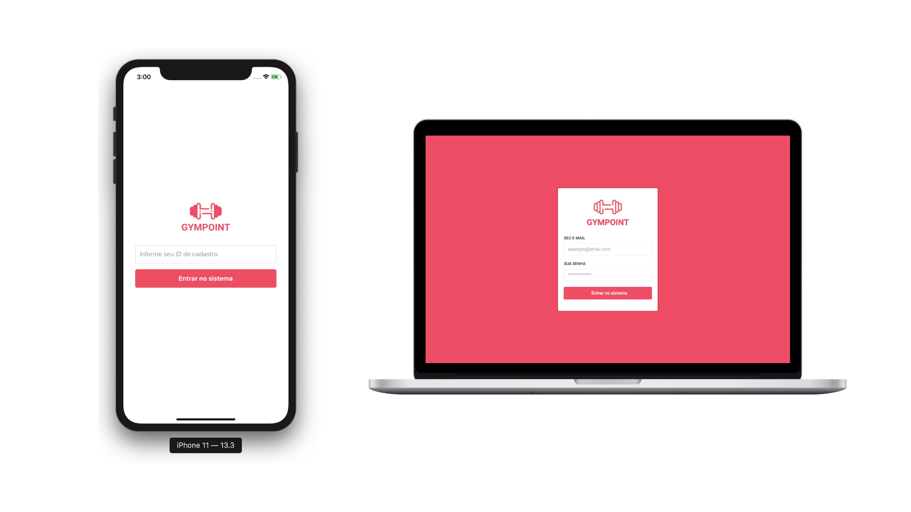

<h1 align="center">
  
</h1>

<h3 align="center">
  Backend, Frontend e Mobile do Gympoint App
</h3>

<blockquote align="center">“Pequenas ações, se acompanhadas de disciplina e constância, revolucionam!”!</blockquote>

<p align="center">
  <a href="#-tecnologias">Tecnologias</a>&nbsp;&nbsp;&nbsp;|&nbsp;&nbsp;&nbsp;
  <a href="#-projeto">Projeto</a>&nbsp;&nbsp;&nbsp;|&nbsp;&nbsp;&nbsp;
  <a href="#-instalação-e-execução">Instalação e execução</a>&nbsp;&nbsp;&nbsp;|&nbsp;&nbsp;&nbsp;
  <a href="#-licença">Licença</a>
</p>

<p align="center">
  

  <a href="https://github.com/bernardoamim">
    
  </a>

  

  <a href="https://github.com/Rocketseat/bootcamp-gostack-desafio-10/stargazers">
    
  </a>
</p>

<br>

<p align="center">
  
</p>

## 🚀 Tecnologias

Esse projeto foi desenvolvido com as seguintes tecnologias:

<p align="center">
  <a href="https://nodejs.org/en/"></a> &nbsp;&nbsp;&nbsp;&nbsp;&nbsp;&nbsp;
  <a href="https://reactjs.org"></a> &nbsp;&nbsp;&nbsp;&nbsp;&nbsp;&nbsp;
  <a href="https://facebook.github.io/react-native/"></a> &nbsp;&nbsp;&nbsp;&nbsp;&nbsp;&nbsp;
</p>

## 💻 Descrição do Projeto

Gympoint é um software para controle e gestão de academias e está dividido em três partes. O backend está estruturado em NodeJS e é responsável por disponibilizar uma API para que o frontend e o mobile possam consumí-la e exibir as informações para o usuário.

A parte WEB foi construída com as tecnologias ReactJs + Redux. Nela, os administradores da academia podem fazer a gestão de alunos, planos, matrículas e pedidos de ajuda.

Já o aplicativo mobile foi desenvolvido em React Native e tem a função de dar ao aluno a possibilidade de fazer Checkins na academia, enviar pedidos de ajuda e acompanhar as respostas de cada um.

## 📥 Instalação

Primeiramente, clone esse repositório em uma pasta.

### Backend

1. A partir da raiz do projeto, entre na pasta rodando `cd backend`;
2. Inicie os bancos de dados postgresql, mongodb e redis utilizando docker, e crie o banco `gympoint` no postgres:

```bash
  $ docker run --name postgres -e POSTGRES_PASSWORD=docker -p 5432:5432 -d postgres:11
  $ docker run --name mongo -p 27017:27017 -d -t mongo
  $ docker run --name redis -p 6379:6379 -d -t redis:alpine
  $
  $ docker exec -it postgres /bin/sh
  # su postgres
  /$ psql
  postgres=# CREATE DATABASE gympoint;
  postgres=# exit
  /$ exit
  # exit
```

3. Crie um arquivo `.env` a partir do arquivo `.env.example` preenchendo todas as variáveis pedidas;
4. Rode `npm install` para instalar todas as dependências;
5. Rode `npx sequelize db:migrate` para criar as migrations;
6. Rode `npx sequelize db:seed:all` para popular o banco;
7. Rode `npm run queue` para iniciar o consumo das filas;
8. Rode `npm run build && npm run start` em um novo terminal para compilar e iniciar o servidor node;

### Frontend

1. A partir da raiz do projeto, entre na pasta rodando `cd frontend`;
2. Rode `npm install` para instalar as dependências;
3. Rode `npm run start` para iniciar o servidor de desenvolvimento;
4. Abra `http://localhost:3000` para ver o projeto no navegador.

### Mobile

1. A partir da raiz do projeto, entre na pasta rodando `cd mobile`;
2. Rode `npm install` para instalar as dependências;
3. Rode `npm run start` para iniciar o servidor de desenvolvimento;
4. Cheque o ip do servidor e substitua `localhost` do atributo `baseURL` no arquivo `src > services > api.js`;
5. Rode `npm run android` para iniciar a instalação no smartphone;

<i>Obs.:</i> Projeto mobile desenvolvido apenas para a plataforma <strong>android</strong>.

## 📝 Licença

Esse projeto está sob a licença MIT. Veja o arquivo [LICENSE](LICENSE.md) para mais detalhes.
